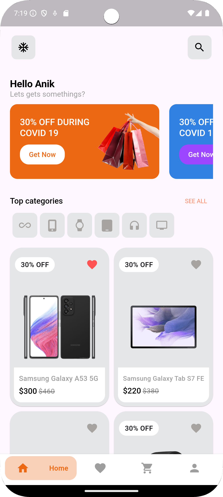
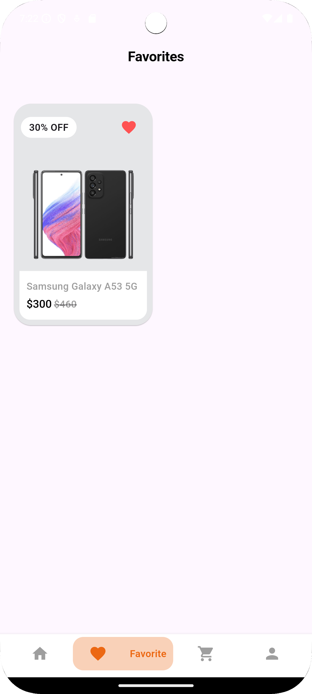
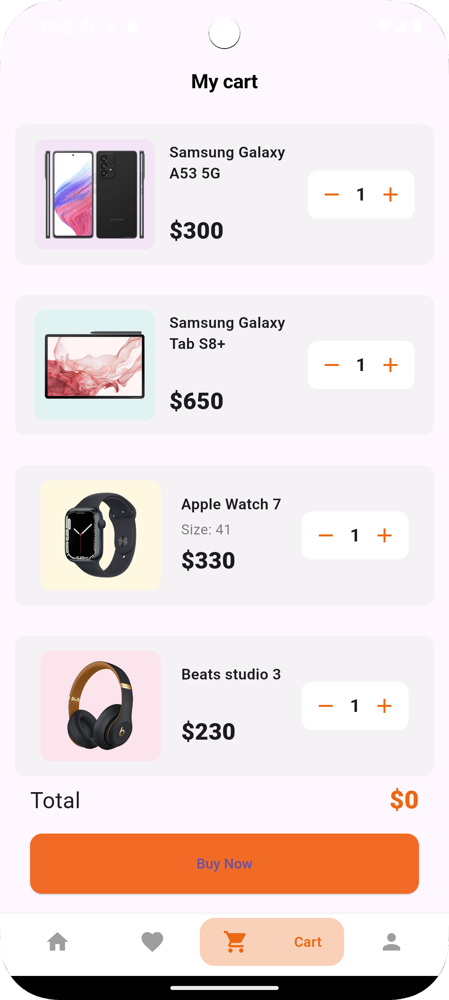

# E-Commerce App

An **E-Commerce** application built using **Flutter** that provides a seamless shopping experience with features like product browsing, cart management, user authentication, and secure payment processing.

## 📱 Features

- **User Authentication**: Login, Registration, and Profile Management.
- **Product Catalog**: View products with filtering and sorting options.
- **Product Search**: Quickly search for products using various filters.
- **Cart Management**: Add/remove products from the cart and view cart summary.
- **Checkout & Payment**: Secure checkout process with integrated payment gateways.
- **Order Management**: View order history and order details.
- **Wishlist**: Add items to your wishlist for future purchases.
- **Push Notifications**: Stay updated with order status and promotions.
  
## 🛠️ Technologies Used

- **Flutter** (Dart)
- **Firebase** for Authentication, Firestore for Database, and Firebase Storage
- **Provider** or **GetX** for State Management
- **Stripe** or **Razorpay** for Payment Gateway
- **REST APIs** for backend integration
- **Sqflite** or **Hive** for local storage of cart data

## 🚀 Getting Started

### Prerequisites

- [Flutter SDK](https://flutter.dev/docs/get-started/install) version 3.24.1 or above
- [Dart](https://dart.dev/get-dart) version 3.5.1
- An IDE like [Android Studio](https://developer.android.com/studio) or [VS Code](https://code.visualstudio.com/)

### Installation

1. **Clone the Repository**
   ```bash
   git clone https://github.com/anikhofficial/ecommerce-flutter-app.git
   cd ecommerce-flutter-app
   ```

2. **Install Dependencies**
   Run the following command to install all required packages from `pubspec.yaml`:
   ```bash
   flutter pub get
   ```

3. **Setup Firebase**
   - Create a Firebase project in the [Firebase Console](https://console.firebase.google.com/).
   - Download the `google-services.json` file for Android and place it in the `android/app` directory.
   - For iOS, download the `GoogleService-Info.plist` and add it to the iOS project.
   - Enable **Firebase Authentication** and **Firestore** for data storage.

4. **Run the App**
   Run the following command to build and run the app:
   ```bash
   flutter run
   ```

## 🛒 Screenshots

| Home Screen | Favorite | Cart | Profile |
|-------------|--------------|------|----------|
|  |  |  |  |

## 🔌 API Integration

This app integrates with backend APIs for fetching product data, order processing, and user profile management. You can connect it to a custom backend using **Node.js**, **Laravel**, or any backend of your choice.

## 📦 Dependencies

- `firebase_core`: For integrating Firebase
- `firebase_auth`: For user authentication
- `cloud_firestore`: For Firestore database
- `provider`: For state management (or `GetX`)
- `stripe_payment`: For Stripe payment gateway integration (or `razorpay_flutter` for Razorpay)
- `sqflite` or `hive`: For local storage of cart items

## 💻 Folder Structure

```
lib/
│
├── models/            # Data models (User, Product, Order, etc.)
├── providers/         # State management
├── screens/           # UI screens (Home, Product Details, Cart, etc.)
├── services/          # API services and Firebase integrations
├── widgets/           # Custom reusable widgets
└── main.dart          # Main entry point of the app
```

## 📖 Documentation

Detailed documentation can be found in the `docs/` folder, covering API integrations, app architecture, and deployment instructions.

## 👨‍💻 Contributing

If you'd like to contribute, please create a pull request, and ensure your code follows the established structure and conventions. For major changes, please open an issue to discuss your ideas.

## 🛡️ License

This project is licensed under the MIT License - see the [LICENSE](LICENSE) file for details.

---

### 📧 Contact

For questions or support, feel free to reach out:

- **GitHub**: [anikhofficial](https://github.com/anikhofficial)
- **Fiverr**: [anikhofficial](https://www.fiverr.com/anikhofficial)
- **LinkedIn**: [anikhofficial](https://www.linkedin.com/in/anikhofficial/)
```
